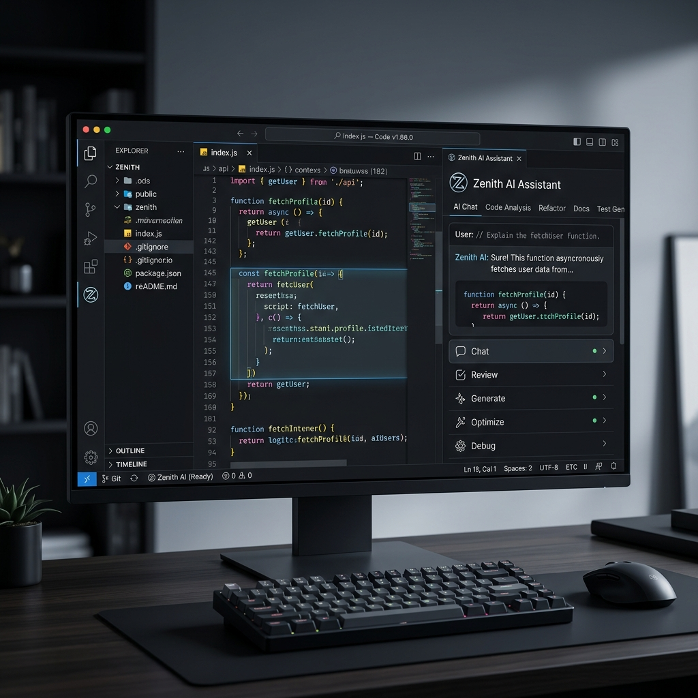
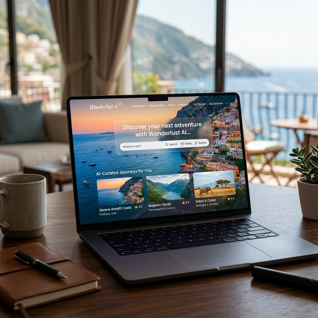

# Aman T Shekar | Full Stack Engineer

Architecting digital experiences through engineering precision. Specializing in high-performance React applications, MERN stack, and AI-driven logic.

## 🚀 Featured Artifacts

### Zenith IDE Ecosystem

Next-gen design-to-code platform for architectural web engineering. 

### Travel Blog Template

Premium Travel Blog Architecture designed for cinematic storytelling and immersive typography.

## 🛠️ Technical Ecosystem
- **Core**: JavaScript (ES6+), TypeScript, React.js, Next.js, Node.js, Express.js, Python, Rust
- **Infrastructure**: MongoDB, PostgreSQL, SQL, LanceDB, Redis, AWS, Docker, Vercel
- **Intelligence & Motion**: Ollama, GSAP, ScrollTrigger, Framer Motion, AI-Driven Logic, Redux, JWT

---
[View My Portfolio](https://amantshekar.github.io/Aman.github.io/)